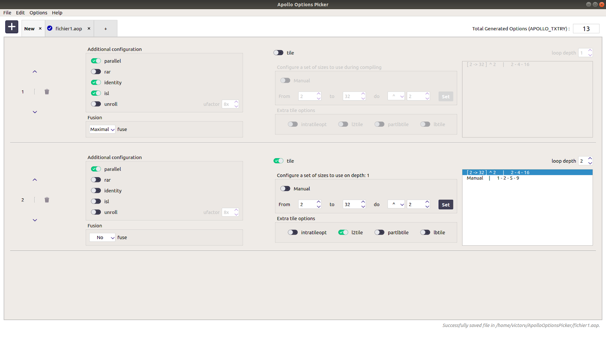

# ApolloOptionsPicker

## Contributors
Victor VOGT - Philippe Clauss

## General
This UI is meant to be used with the [APOLLO framework](https://webpages.gitlabpages.inria.fr/apollo/about).
It permits to choose speculative compilation options to give to the compiler.

## Features
- Import/Export of compilation settings
- Multi sheets edition
- Tiling profiling
- Pluto options profiling
- Dark/Light mode

## Screenshots

## Licences
Université de Strasbourg - Master 1 Sciences et Ingénierie du Logiciel - TER - 2020/2021
